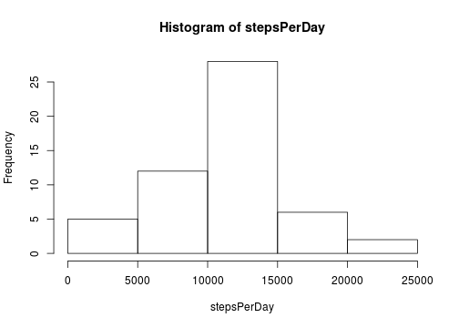
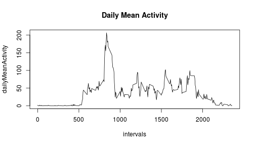
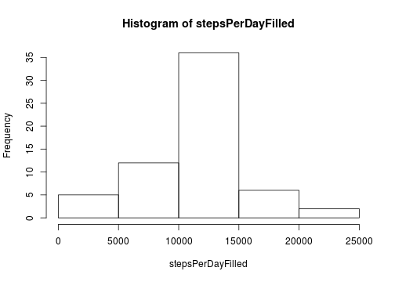
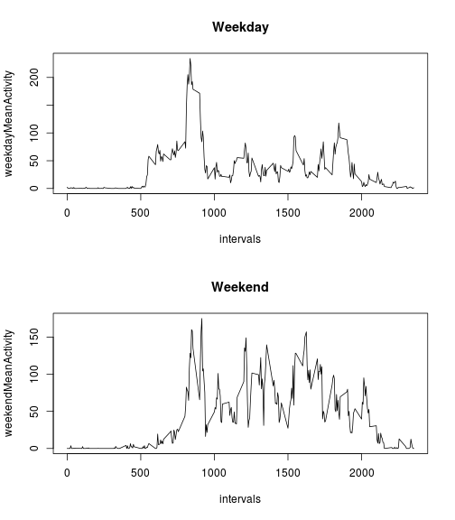

## Loading and preprocessing the data

```r
dat<-read.csv('activity.csv')
```
## What is mean total number of steps taken per day?

```r
#Finding the sum of all the steps taken per day
stepsPerDay<-sapply(split(dat$steps,dat$date),sum)
hist(stepsPerDay)
```

 

```r
meanSteps<-mean(stepsPerDay[!is.na(stepsPerDay)])
medianSteps<-median(stepsPerDay[!is.na(stepsPerDay)])
```
The mean steps per day is 1.0766189 &times; 10<sup>4</sup> and the median steps per day is 10765.  

## What is the average daily activity pattern?

```r
#Create vector with mean activity per day. 
dailyMeanActivity<-tapply(dat$step,dat$interval,mean,na.rm=TRUE)

#Creating vector with each time interval
intervals=levels(factor(dat$interval))

plot(intervals,dailyMeanActivity,type="l",main='Daily Mean Activity')
```

 

```r
maxInd<-match(max(dailyMeanActivity),dailyMeanActivity)
maxInterval<-intervals[maxInd]
```
The 5 minute interval containing the maximum number of steps is at 835  
## Inputing missing values

```r
#Strategy to input missing values is to take the daily mean activity for each respective time interval and to replace each missing value with it.

datFilled<-dat #Initializing vector of filled values
dailyMeanVec<-rep(dailyMeanActivity,length=length(dat$steps)) #Creating a vector of the daily mean value for each time interval for all the days
for(i in 1:length(dat$steps)){ #Loop goes through the data and fills in the missing value with the respective daily mean value.
        if(is.na(datFilled[i,'steps'])==TRUE){
                datFilled[i,'steps']<-dailyMeanVec[i]
        }
}

stepsPerDayFilled<-sapply(split(datFilled$steps,datFilled$date),sum) #Vector of sum of steps per day for filled data.
hist(stepsPerDayFilled)
```

 

```r
meanStepsFill<-mean(stepsPerDayFilled[!is.na(stepsPerDayFilled)])
medianStepsFill<-median(stepsPerDayFilled[!is.na(stepsPerDayFilled)])
meanStepsDiff<-abs(meanStepsFill-meanSteps)
medianStepsDiff<-abs(medianStepsFill-medianSteps)
```
Mean steps taken per day is 1.0766189 &times; 10<sup>4</sup>. Median steps taken per day is 1.0766189 &times; 10<sup>4</sup>.  The mean steps did not change after filling in the data. This is reasonable since the data filled in was the mean activity for that day so adding data points in from the mean would not shift the mean. The median of the filled data was slightly raised to equal the mean. 

## Are there differences in activity patterns between weekdays and weekends?

```r
week<-sapply(as.Date(dat$date),weekdays)
isWeekend<-rep(c('Weekday','Weekend'),length=length(week))
for(i in 1:length(week)){
        if(week[i]=='Monday'| week[i]=='Tuesday'| week[i]=='Wednesday'| week[i]=='Thursday'| week[i]=='Friday'){
                isWeekend[i]<-'Weekday'
                } else{
                        isWeekend[i]<-'Weekend'
                }
}
dat<-data.frame(dat,isWeekend)
weekdayMeanActivity<-tapply(dat[dat['isWeekend']=='Weekday','steps'],dat[dat['isWeekend']=='Weekday','interval'],mean,na.rm=TRUE)
weekendMeanActivity<-tapply(dat[dat['isWeekend']=='Weekend','steps'],dat[dat['isWeekend']=='Weekend','interval'],mean,na.rm=TRUE)

par(mfrow=c(2,1))
plot(intervals,weekdayMeanActivity,type='l',main='Weekday')
plot(intervals,weekendMeanActivity,type='l',main='Weekend')
```

 
